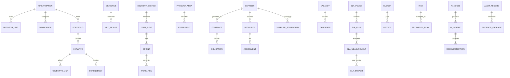
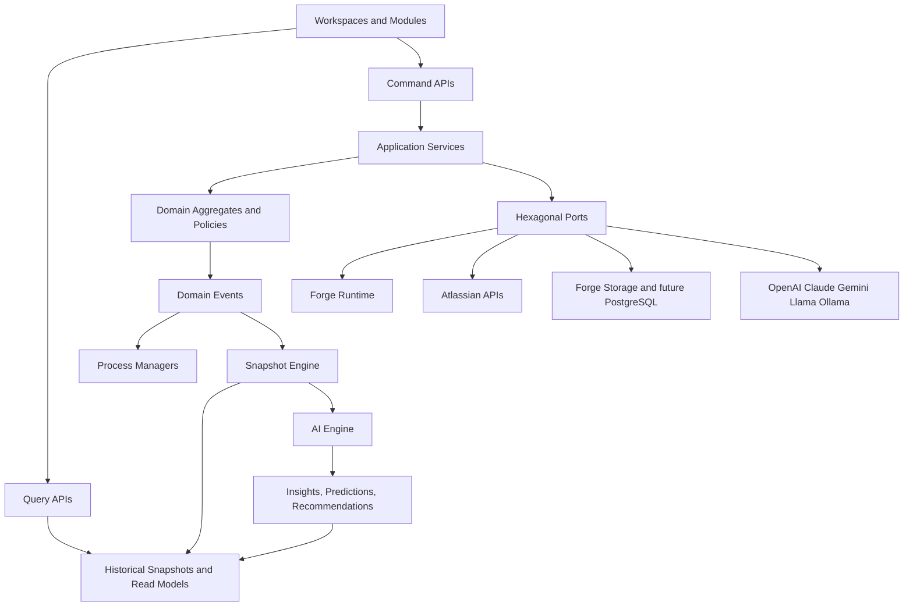

# FlowOS Architecture Constitution

## 1. Architecture Decision Record

### ADR-001: FlowOS is a domain-driven enterprise platform, not a dashboard application

**Status:** Accepted.

**Context.** Agile Command Center started with an executive dashboard foundation. That foundation is useful for proving Forge, React, TypeScript, repository ports, and AI provider boundaries, but it creates the wrong architectural gravity if dashboards become the product center.

**Decision.** FlowOS is refactored conceptually into a Domain-Driven Enterprise Platform. Dashboards, reports, chats, exports, and AI experiences are projections over domain-owned snapshots. The domain model owns meaning, invariants, lifecycle, events, and policies. UI and AI consume domain facts; they do not define them.

**Consequences.**

- Business domains own data and behavior.
- Dashboard reads are query-side projections.
- KPI calculations move into the Snapshot Engine.
- AI becomes its own bounded context and consumes governed context packages.
- Feature modules and workspaces compose capabilities from domains without owning domain rules.

### ADR-002: Event-driven snapshot architecture is the default

**Status:** Accepted.

**Decision.** FlowOS does not calculate enterprise KPIs in UI request paths. Jira, Confluence, JSM, Bitbucket, Compass, supplier, contract, workforce, finance, and AI facts are captured as events, normalized into facts, calculated into snapshots, and exposed through query models.

**Justification.** This design provides historical trends, repeatability, auditability, performance at enterprise scale, and the ability to recompute metrics when formulas change.

### ADR-003: CQRS-ready ports are mandatory

**Status:** Accepted.

**Decision.** Commands mutate aggregates and emit events. Queries read snapshots and read models. The repository layer is split between aggregate repositories, event repositories, snapshot repositories, and read-model repositories.

**Justification.** Jira Cloud apps must remain responsive. Enterprise analytics need optimized read models and historical calculations that are independent from command workflows.

### ADR-004: Forge remains the Marketplace control plane

**Status:** Accepted.

**Decision.** Forge remains the primary Atlassian Marketplace runtime, permission boundary, tenant entry point, and UI delivery mechanism. Heavy analytics can later move to a remote compute plane behind the same ports if Forge limits are reached.

**Trade-off.** Forge maximizes Marketplace fit and Atlassian trust, while remote compute may be required for high-volume historical analytics, long-running model jobs, or PostgreSQL-backed read models.

### ADR-005: AI is governed as a domain

**Status:** Accepted.

**Decision.** AI artifacts are first-class domain objects: Insight, Prediction, Recommendation, Anomaly, Risk Assessment, Executive Summary, Decision Suggestion, Prompt Template, Model Registry, Provider Registry, Conversation Context, Memory, and AI Audit.

**Justification.** Enterprise AI needs traceability, provider interchangeability, prompt governance, model routing, privacy controls, and evidence-backed recommendations.

## 2. Domain Model

### Root domains

| Domain | Purpose | Key aggregates | Primary repositories | Important events |
| --- | --- | --- | --- | --- |
| Organization | Enterprise identity, structure, operating model, health | Organization, BusinessUnit, OperatingModel, OrganizationHealth | OrganizationRepository, OrganizationHealthRepository | OrganizationConfigured, OrganizationHealthCalculated |
| Portfolio | Investment, initiatives, themes, portfolio risks | Portfolio, Initiative, InvestmentTheme, PortfolioRoadmap | PortfolioRepository, InitiativeRepository | InitiativeCreated, InitiativeReprioritized, PortfolioRiskDetected |
| Delivery | Flow of work, sprints, boards, releases, delivery health | DeliverySystem, TeamFlow, Sprint, Release, WorkItem | DeliverySystemRepository, SprintRepository, WorkItemRepository | IssueUpdated, SprintStarted, SprintCompleted, ReleaseForecastGenerated |
| Product | Outcomes, discovery, experiments, roadmaps | ProductArea, ProductOutcome, Experiment, ProductRoadmap | ProductRepository, ExperimentRepository | OutcomeDefined, ExperimentStarted, ExperimentCompleted |
| People | Individuals, teams, roles, skills, engagement | Person, Team, SkillProfile, EngagementSignal | PersonRepository, TeamRepository | PersonAssigned, SkillAdded, EngagementRiskDetected |
| Workforce | Vendors, resources, vacancies, recruiting, onboarding, capacity | WorkforcePlan, Resource, Vacancy, Candidate, Offer, Assignment | ResourceRepository, VacancyRepository, CandidateRepository | ResourceJoined, ResourceLeft, CandidateAccepted, CandidateRejected |
| Supplier | Providers, supplier health, vendor score, replacement capability | Supplier, SupplierScorecard, VendorRelationship | SupplierRepository, SupplierScoreRepository | SupplierOnboarded, SupplierHealthCalculated, SupplierRiskDetected |
| Contract | Contract lifecycle, commercial terms, obligations, renewals | Contract, StatementOfWork, RateCard, Obligation | ContractRepository, ObligationRepository | ContractSigned, ContractExpired, ObligationBreached |
| Resource | Capacity-bearing people or service resources | ResourceProfile, Allocation, AvailabilityCalendar | ResourceProfileRepository, AllocationRepository | ResourceAllocated, AvailabilityChanged |
| SLA | Generic rule-based service obligations | SlaPolicy, SlaRule, SlaMeasurement, SlaBreach | SlaPolicyRepository, SlaMeasurementRepository | SLAViolated, SlaRecovered, SlaExceptionApplied |
| Capacity | Capacity plans, allocation, forecasting | CapacityPlan, CapacityForecast, AllocationScenario | CapacityPlanRepository, CapacityForecastRepository | CapacityChanged, CapacityForecastGenerated |
| Finance | Budget, cost, ROI, penalties, invoices | Budget, CostCenter, Invoice, FinancialForecast | BudgetRepository, InvoiceRepository | InvoiceSubmitted, BudgetThresholdExceeded, PenaltyCalculated |
| Risk | Enterprise risk detection and mitigation | Risk, RiskAssessment, MitigationPlan | RiskRepository, RiskAssessmentRepository | RiskDetected, RiskAccepted, RiskMitigated |
| Dependency | Cross-team/product/supplier dependencies | Dependency, DependencyGraph, CriticalPath | DependencyRepository, DependencyGraphRepository | DependencyCreated, DependencyBlocked, CriticalPathChanged |
| Objective | OKRs, goals, strategic alignment | Objective, KeyResult, StrategicAlignment | ObjectiveRepository, KeyResultRepository | ObjectiveCreated, KeyResultUpdated, ObjectiveAtRisk |
| AI | AI knowledge, model routing, generated intelligence | Insight, Prediction, Recommendation, PromptTemplate, Conversation | InsightRepository, ModelRegistryRepository, ConversationRepository | InsightGenerated, PredictionGenerated, RecommendationAccepted |
| Notification | Alerts, subscriptions, escalations | NotificationRule, Notification, Escalation | NotificationRepository, SubscriptionRepository | NotificationSent, EscalationTriggered |
| Audit | Immutable platform evidence and decision trail | AuditRecord, EvidencePackage, ComplianceTrail | AuditRepository, EvidenceRepository | AuditRecorded, EvidenceAttached |
| Administration | Tenant configuration, feature flags, products, workspaces | TenantConfiguration, FeatureFlag, ProductEntitlement, Workspace | TenantConfigurationRepository, FeatureFlagRepository | FeatureEnabled, ProductEntitled, WorkspaceConfigured |

### Shared value objects

- `TenantId`, `OrganizationId`, `WorkspaceId`, `ProductEntitlementId`.
- `Money`, `Currency`, `Percentage`, `Score`, `Trend`, `ConfidenceLevel`.
- `DateRange`, `BusinessPeriod`, `WorkingCalendar`, `TimeZone`.
- `JiraIssueKey`, `JiraProjectKey`, `JiraBoardId`, `ConfluencePageId`.
- `HealthStatus`, `RiskSeverity`, `Priority`, `EvidenceRef`.
- `CapacityUnit`, `SkillLevel`, `RoleName`, `SupplierTier`.

### Aggregate rules

- Aggregates enforce invariants inside one tenant boundary.
- Cross-domain coordination happens through events and process managers, never direct aggregate mutation.
- Domain services contain business logic that does not naturally belong to one aggregate.
- Factories create aggregates only when all required invariants are present.
- Policies are explicit, versioned, and auditable.

## 3. Bounded Contexts

| Bounded context | Responsibilities | Depends on | Public interfaces | Ownership |
| --- | --- | --- | --- | --- |
| Enterprise Core | Organization structure, health model, tenant operating model, product entitlements | Administration, Audit | OrganizationHealthQuery, ConfigureOrganizationCommand | Platform Architecture |
| Delivery Management | Jira work ingestion, sprints, flow, releases, delivery KPIs | Enterprise Core, Dependency, AI Engine | DeliverySnapshotQuery, SprintLifecycleEvents | Delivery Product Team |
| Portfolio Management | Initiatives, roadmap, value, WSJF/RICE/ROI, portfolio risks | Enterprise Core, Finance, Objective, Delivery | PortfolioCommandApi, PortfolioSnapshotQuery | Portfolio Product Team |
| Product Management | Product outcomes, discovery, experiments, impact | Portfolio, Objective, Delivery | ProductOutcomeCommandApi, ProductInsightsQuery | Product Product Team |
| Workforce Management | Suppliers, resources, vacancies, recruitment, assignments, capacity, availability | Supplier, Contract, SLA, Finance | WorkforceCommandApi, WorkforceSnapshotQuery | Workforce Product Team |
| Supplier Management | Supplier lifecycle, vendor score, supplier health, contract performance | Contract, SLA, Finance, Workforce | SupplierScoreQuery, SupplierLifecycleCommandApi | Supplier Product Team |
| AI Engine | Model registry, provider routing, insights, predictions, conversations, memory, audit | Audit, all query contexts | GenerateInsightCommand, AiRecommendationQuery | AI Platform Team |
| Reporting | Snapshot packaging, executive reports, exports to Confluence/PDF/PPT/email | Enterprise Core, AI Engine, Notification | ReportGenerationCommand, ReportQuery | Intelligence Product Team |
| Administration | Tenant config, feature flags, workspace config, marketplace entitlements | Identity, Audit | AdminCommandApi, EntitlementQuery | Platform Team |
| Identity | User, group, role, Atlassian account mapping, authorization decisions | Administration | AuthorizationPolicyQuery, IdentityResolutionPort | Security Platform Team |

## 4. Event Model

### Event categories

| Category | Events |
| --- | --- |
| Atlassian ingestion | JiraIssueCreated, JiraIssueUpdated, JiraIssueTransitioned, JiraIssueBlocked, JiraIssueUnblocked, JiraSprintStarted, JiraSprintCompleted, JiraReleaseCreated, JiraReleaseReleased, ConfluencePagePublished, PullRequestMerged, ServiceRequestBreached |
| Delivery | WorkItemCommitted, WorkItemCompleted, ScopeChanged, SprintGoalChanged, SprintRiskDetected, FlowMetricCalculated, ReleaseForecastGenerated |
| Portfolio and product | InitiativeCreated, InitiativeApproved, InitiativeReprioritized, RoadmapChanged, ProductOutcomeDefined, ExperimentStarted, ExperimentCompleted, ObjectiveLinkedToInitiative |
| Workforce | ResourceJoined, ResourceLeft, ResourceAllocated, ResourceReleased, AvailabilityChanged, VacancyOpened, CandidateSubmitted, CandidateAccepted, CandidateRejected, InterviewScheduled, OfferAccepted, OnboardingStarted, OffboardingCompleted |
| Supplier and contract | SupplierOnboarded, SupplierHealthCalculated, ContractSigned, ContractRenewed, ContractExpired, RateCardChanged, ObligationBreached, ReplacementRequested, KnowledgeTransferCompleted |
| SLA | SlaPolicyCreated, SlaRuleChanged, SlaMeasurementCaptured, SLAViolated, SlaRecovered, SlaPenaltyCalculated, SlaExceptionApplied, SlaEscalationTriggered |
| Finance | BudgetCreated, BudgetThresholdExceeded, InvoiceSubmitted, InvoiceApproved, CostForecastGenerated, PenaltyCalculated, RoiCalculated |
| Risk and dependency | DependencyCreated, DependencyResolved, DependencyBlocked, CriticalPathChanged, RiskDetected, RiskAssessed, RiskAccepted, RiskMitigated |
| AI | PromptTemplatePublished, ModelRegistered, ProviderConfigured, InsightGenerated, PredictionGenerated, AnomalyDetected, RecommendationGenerated, RecommendationAccepted, RecommendationRejected, ExecutiveSummaryGenerated |
| Notification and audit | NotificationSent, EscalationTriggered, AuditRecorded, EvidenceAttached, FeatureEnabled, FeatureDisabled, WorkspaceConfigured |

### Event envelope

Every event contains: `eventId`, `eventType`, `tenantId`, `aggregateId`, `boundedContext`, `occurredAt`, `schemaVersion`, `correlationId`, `causationId`, `actor`, `source`, `payload`, `evidence`, and `privacyClassification`.

### Event policies

- Events are immutable.
- Consumers are idempotent.
- Event schemas are versioned.
- Events can be replayed into snapshots and read models.
- External Atlassian webhooks are translated into internal domain events before business processing.

## 5. Data Model

### Conceptual ER diagram



### Ownership and lifecycle

| Entity | Owner context | Lifecycle owner | Retention rationale |
| --- | --- | --- | --- |
| Organization | Enterprise Core | Tenant administrator | Tenant configuration and health history |
| Initiative | Portfolio Management | Portfolio manager | Strategic traceability and ROI history |
| WorkItem | Delivery Management | Jira ingestion adapter | Delivery trend and audit evidence |
| Objective | Objective domain inside Enterprise Core | Business owner | OKR history and strategic accountability |
| Resource | Workforce Management | Workforce manager | Capacity, cost, SLA, onboarding/offboarding history |
| Supplier | Supplier Management | Vendor manager | Supplier health, commercial, and compliance history |
| Contract | Contract Management | Contract owner | Legal and penalty evidence |
| SlaPolicy | SLA domain | Service owner | Versioned contractual obligations |
| Insight | AI Engine | AI governance owner | AI auditability and feedback loop |
| Snapshot | Reporting/Analytics | Snapshot Engine | Historical trend and query performance |

## 6. Module Architecture

Feature modules are product capabilities, not domain owners. Each module can be enabled independently through existing feature flags and product entitlements.

| Module | Primary domains consumed | Purpose |
| --- | --- | --- |
| Executive | Organization, Portfolio, Delivery, Product, Workforce, Supplier, Finance, AI | Leadership operating view and Organization Health |
| Delivery | Delivery, Dependency, Risk, Capacity, AI | Flow, sprint, release, and delivery governance |
| Portfolio | Portfolio, Objective, Finance, Risk, Dependency | Investment, roadmap, prioritization, and initiative governance |
| Product | Product, Objective, Delivery, AI | Outcomes, experiments, roadmap, and discovery evidence |
| Workforce | Workforce, Resource, Capacity, Supplier, Finance | Resource lifecycle, availability, bench, vacancies, and workforce cost |
| Supplier | Supplier, Contract, SLA, Workforce, Finance | Vendor performance, supplier health, scorecards, and risk |
| Contracts | Contract, SLA, Finance, Audit | Obligations, terms, renewal, penalties, and evidence |
| SLA | SLA, Notification, Audit, Supplier | Rule configuration, measurement, breach detection, escalation |
| Capacity | Capacity, Workforce, Delivery, Portfolio | Forecasting and allocation scenarios |
| Finance | Finance, Portfolio, Supplier, Contract | Budget, cost, ROI, invoice, and penalty analytics |
| OKRs | Objective, Product, Portfolio, Delivery | Strategic alignment and key-result progress |
| Reports | Reporting, AI, Notification, Audit | Executive summaries and scheduled output packages |
| Administration | Administration, Identity, Audit | Tenant setup, features, workspaces, entitlements, roles |
| AI | AI, Audit, all query contexts | Chat, recommendations, predictions, anomalies, model governance |
| Analytics | Snapshot Engine, all event streams | Historical trends, benchmarks, and advanced calculations |
| Notifications | Notification, Risk, SLA, AI | Alerting, escalation, subscriptions, and action nudges |

## 7. Workspace Architecture

Workspaces compose modules and permissions for personas.

| Workspace | Primary users | Capabilities |
| --- | --- | --- |
| Executive Workspace | CEO, CTO, CPO, CIO, PMO/VMO leaders | Organization Health, portfolio health, financial health, supplier health, AI executive summaries |
| Delivery Workspace | Delivery managers, Scrum Masters, Agile Coaches | Sprint health, flow metrics, release risk, blocked work, delivery recommendations |
| Product Workspace | CPO, Product Managers, Product Ops | Outcomes, roadmap, discovery, experiments, OKRs, impact insights |
| Supplier Workspace | Vendor managers, procurement, delivery governance | Supplier score, SLA, contracts, resource performance, replacement risks |
| Finance Workspace | Finance partners, portfolio finance, VMO | Budget, cost, invoices, penalties, ROI, forecast variance |
| VMO Workspace | Vendor Management Office, PMO | Supplier portfolio, contract compliance, staffing, SLA penalties, governance reporting |
| Administration Workspace | Jira admins, app admins, security admins | Configuration, entitlements, feature flags, identity mapping, audit logs |
| Engineering Workspace | Engineering managers, platform leads | Engineering health, dependencies, Compass/Bitbucket signals, delivery quality |

## 8. AI Architecture

### AI domain objects

- `Insight`: evidence-backed interpretation of facts.
- `Prediction`: probabilistic forecast with confidence and method.
- `Recommendation`: suggested action linked to expected impact.
- `Anomaly`: statistically or rule-detected deviation.
- `RiskAssessment`: AI-assisted risk interpretation with evidence.
- `ExecutiveSummary`: narrative synthesis for leadership periods.
- `DecisionSuggestion`: option set with trade-offs and confidence.
- `PromptTemplate`: versioned prompt asset with input contract.
- `ModelRegistry`: available model capabilities, limits, regions, cost profile.
- `ProviderRegistry`: OpenAI, Claude, Gemini, Llama, Ollama, and future providers.
- `ConversationContext`: tenant, user, permissions, workspace, selected evidence.
- `Memory`: approved long-lived organizational context with explicit retention policy.
- `AiAudit`: prompt, model, evidence, response hash, policy checks, feedback.

### Provider interchangeability

AI calls use an `AiProvider` port with provider-neutral request and response contracts. Provider adapters implement model-specific authentication, token budgeting, safety configuration, streaming, and tool-calling. Model routing is policy-based and can select providers by tenant entitlement, data residency, cost, latency, privacy classification, or capability.

### AI governance

- AI cannot access raw tenant data unless authorized by Identity and scoped by workspace.
- Every AI output cites evidence references from snapshots or facts.
- Recommendations have feedback states: accepted, rejected, deferred, implemented.
- Prompt templates are versioned and reviewed.
- AI memory is explicit, tenant-scoped, permission-aware, and auditable.

## 9. Workforce Architecture

### First-class workforce entities

| Area | Entities |
| --- | --- |
| Providers | Supplier, ProviderCapability, SupplierTier, VendorRelationship |
| Contracts | Contract, StatementOfWork, RateCard, Obligation, RenewalWindow |
| Resources | Resource, ResourceProfile, RoleAssignment, AvailabilityCalendar, SkillProfile |
| Skills | Skill, SkillCategory, SkillLevel, Certification, SkillGap |
| Bench | BenchPool, BenchAssignment, BenchCost, RedeploymentOption |
| Vacancies | Vacancy, Requirement, StaffingRequest, FulfillmentPlan |
| Recruitment | Candidate, Interview, Evaluation, Offer, AcceptanceDecision |
| Lifecycle | OnboardingPlan, OffboardingPlan, KnowledgeTransferPlan, ReplacementPlan |
| Performance | PerformanceReview, DeliveryContribution, QualitySignal, NpsResponse |
| Commercial | Invoice, CostAllocation, Penalty, RateCardLine, BudgetImpact |
| Capacity | CapacityPlan, Availability, Allocation, ForecastScenario |
| Supplier health | SupplierScorecard, SupplierRisk, SupplierRecommendation |

### Workforce policies

- A resource cannot be allocated beyond policy-defined capacity without an explicit exception.
- Candidate acceptance creates onboarding, assignment, capacity, and audit events.
- Resource exit creates offboarding, replacement, knowledge-transfer, supplier-risk, and capacity-impact events.
- Supplier health is recalculated when SLA, rotation, performance, cost, availability, NPS, delivery, or replacement facts change.

### Supplier Health Score

Inputs: SLA performance, rotation, performance reviews, knowledge-transfer quality, replacement time, NPS, cost variance, delivery health, availability, invoice disputes, and contract breaches.

Outputs: `SupplierHealthScore`, trend, risk classification, explanation, evidence, and recommendation.

Scoring model:

- Weighted factors are configured by tenant and contract type.
- Each factor is normalized to a 0-100 score.
- Confidence reflects data completeness and recency.
- Recommendations are generated by policy first and AI second.

## 10. SLA Engine Architecture

### Generic SLA model

- `SlaPolicy`: owner, scope, applicability, version, status.
- `SlaRule`: condition, threshold, period, measurement method, breach criteria.
- `SlaCondition`: boolean expression over normalized facts.
- `SlaThreshold`: target value, comparator, tolerance, unit.
- `SlaPeriod`: calendar, business hours, evaluation window.
- `SlaException`: approved exclusion with evidence and expiry.
- `SlaMeasurement`: captured result with source facts.
- `SlaBreach`: violation with severity, penalty, escalation, and recovery state.
- `PenaltyPolicy`: commercial consequence formula.
- `EscalationPolicy`: notification route and timing.

### SLA processing pipeline

1. Capture source facts from Jira, JSM, contracts, workforce, supplier, and finance events.
2. Match active SLA policies by tenant, supplier, contract, service, project, or team scope.
3. Evaluate rule conditions and thresholds for the applicable period.
4. Apply exceptions with auditable evidence.
5. Emit `SLAViolated`, `SlaRecovered`, `SlaPenaltyCalculated`, and `SlaEscalationTriggered` events.
6. Store measurements and breaches as historical facts.
7. Notify stakeholders through the Notification context.

### Configuration principle

Any SLA must be configurable through policies and rules without changing application code. New measurement sources are added as adapters that emit normalized facts.

## 11. Repository Structure

The repository remains TypeScript/Forge/React, but architecture ownership is domain-first.

```text
src/
  core/
    shared-kernel/
    domains/
      organization/
      portfolio/
      delivery/
      product/
      people/
      workforce/
      supplier/
      contract/
      resource/
      sla/
      capacity/
      finance/
      risk/
      dependency/
      objective/
      ai/
      notification/
      audit/
      administration/
    application/
      commands/
      queries/
      process-managers/
      snapshot-engine/
    ports/
      commands/
      queries/
      events/
      repositories/
      ai/
      atlassian/
      notifications/
  infrastructure/
    forge/
    atlassian/
    storage/
    event-store/
    snapshots/
    ai-providers/
    security/
    observability/
  modules/
    executive/
    delivery/
    portfolio/
    product/
    workforce/
    supplier/
    contracts/
    sla/
    capacity/
    finance/
    okrs/
    reports/
    administration/
    ai/
    analytics/
    notifications/
  workspaces/
    executive/
    delivery/
    product/
    supplier/
    finance/
    vmo/
    administration/
    engineering/
  frontend/
    shell/
    components/
    visualization/
    theme/
```

## 12. Folder Structure Refactoring Rules

- New domain code goes under `src/core/domains/{domain}`.
- Domain folders contain `entities`, `value-objects`, `aggregates`, `events`, `repositories`, `factories`, `policies`, and `services`.
- Application services are use-case oriented and live outside domain entities.
- Infrastructure adapters depend inward on ports.
- UI modules cannot import infrastructure directly.
- AI providers cannot import dashboard or workspace code.
- Snapshot queries are the only supported data source for dashboards and reports.

## 13. Dependency Diagram



## 14. Product Split

| Product | Capabilities | Shared engine usage |
| --- | --- | --- |
| FlowOS Platform | Tenant administration, identity, audit, feature flags, workspaces | Shared Kernel, Administration, Identity, Audit |
| FlowOS Delivery | Delivery management, sprint health, flow, release risk | Delivery, Capacity, Dependency, Risk, Snapshot Engine |
| FlowOS Workforce | Suppliers, resources, recruitment, contracts, SLA, vendor score | Workforce, Supplier, Contract, SLA, Finance |
| FlowOS Intelligence | Executive summaries, AI coach, recommendations, decision support | AI Engine, Reporting, Notification, Audit |
| FlowOS Analytics | Historical trends, benchmarks, forecasts, portfolio analytics | Event Store, Snapshot Engine, Read Models |
| FlowOS AI | Chat, model registry, prompt governance, memory, AI audit | AI Domain, Provider Registry, Identity, Audit |

## 15. Future Roadmap

1. Create domain folders and shared kernel without changing runtime behavior.
2. Move current `ExecutiveSnapshot` into Organization Health and Snapshot Engine concepts.
3. Introduce event envelope, event repository port, and in-memory test event bus.
4. Refactor `ExecutiveDashboardService` into command/query/snapshot application services.
5. Add workforce, supplier, SLA, and AI domain contracts before adding UI.
6. Implement Forge Storage event/snapshot repositories with versioned schemas.
7. Add Jira webhook ingestion and translation to internal events.
8. Add OpenAI provider adapter with prompt templates, evidence packaging, and AI audit.
9. Add remote compute/PostgreSQL option only after Forge storage and invocation limits are measured.
10. Build workspaces and modules as projections over snapshots.

## 16. Technical Risks

| Risk | Impact | Mitigation |
| --- | --- | --- |
| Forge execution and storage limits | Historical analytics may exceed platform limits | Keep repository ports clean and prepare remote compute/PostgreSQL adapter |
| Atlassian API rate limits | Snapshot capture may lag for large tenants | Incremental ingestion, backoff, event deduplication, scheduled recomputation |
| AI data leakage | Enterprise trust and compliance risk | Evidence scoping, prompt audit, tenant isolation, model routing policies |
| Metric disagreement | Executives may distrust health scores | Versioned formulas, evidence packages, explainable score components |
| Domain over-fragmentation | Delivery slows if every feature requires many contexts | Shared kernel only for stable concepts; context maps reviewed by architecture council |
| Marketplace approval friction | Scopes and external AI calls require scrutiny | Least privilege, clear privacy docs, admin-controlled AI entitlements |

## 17. Trade-offs

- **Event-driven snapshots vs real-time calculations:** snapshots add complexity but provide performance, history, audit, and recomputation.
- **Forge-only vs hybrid architecture:** Forge-only is simpler and Marketplace-native; hybrid unlocks enterprise analytics scale when needed.
- **Domain-first vs dashboard-first:** domain-first delays visible feature velocity but prevents product fragmentation and duplicate KPI logic.
- **Provider-neutral AI vs OpenAI-only:** provider-neutral contracts take more design effort but support enterprise procurement, data residency, and model choice.
- **Generic SLA engine vs hardcoded SLA metrics:** generic rules are harder to design but avoid custom code per contract.

## 18. Refactoring Plan

### Phase 1: Constitution and context map

- Publish this architecture constitution.
- Freeze dashboard feature expansion.
- Align existing docs to domain-first terminology.

### Phase 2: Domain skeleton

- Create domain folders and public contracts.
- Move shared value objects into `shared-kernel`.
- Define event envelope and repository ports.

### Phase 3: Snapshot Engine foundation

- Add event ingestion, normalization, KPI calculation, trend storage, and AI insight generation interfaces.
- Convert executive dashboard reads to snapshot queries.

### Phase 4: Workforce, Supplier, SLA, and AI contracts

- Establish workforce lifecycle, supplier health score, generic SLA rule model, and AI governance interfaces.
- Add tests for policies, scoring, and SLA calculation rules.

### Phase 5: Marketplace hardening

- Add tenant entitlement checks, privacy controls, audit logs, rate-limit handling, and operational observability.

## 19. Organization Health

`OrganizationHealth` is the primary KPI of FlowOS. It is a composite snapshot, not a UI calculation.

Inputs:

- Delivery Health.
- Product Health.
- Engineering Health.
- People Health.
- Supplier Health.
- Financial Health.
- AI Confidence.

Each component exposes score, trend, confidence, evidence, risks, and recommendations. The global score is calculated by a versioned policy so tenants can understand and audit changes over time.

## 20. API Strategy

| API type | Purpose | Examples |
| --- | --- | --- |
| Commands | Mutate aggregates and emit events | ConfigureSlaPolicy, AcceptCandidate, RegisterSupplier, LinkObjective |
| Queries | Read snapshots and read models | GetOrganizationHealth, GetSupplierScorecard, GetSprintHealthSnapshot |
| Events | Publish immutable facts | ResourceLeft, SLAViolated, InsightGenerated |
| Internal APIs | Context-to-context use cases | RecalculateSupplierHealth, GenerateExecutiveSummary |
| Forge APIs | Jira app UI and resolver boundary | Workspace queries, admin configuration, user-scoped reads |
| External APIs | Integrations outside Atlassian | HRIS, ERP, finance, vendor systems |
| AI APIs | Provider-neutral model execution | GenerateInsight, PredictDeliveryRisk, SummarizePortfolio |
